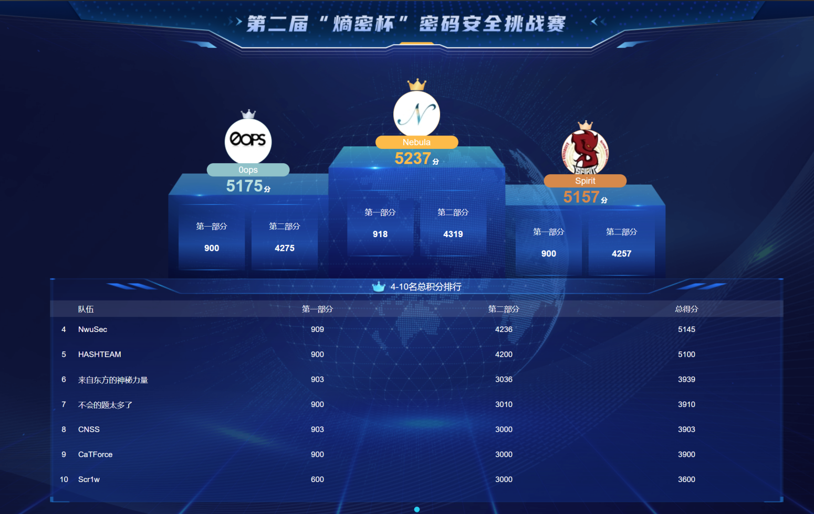
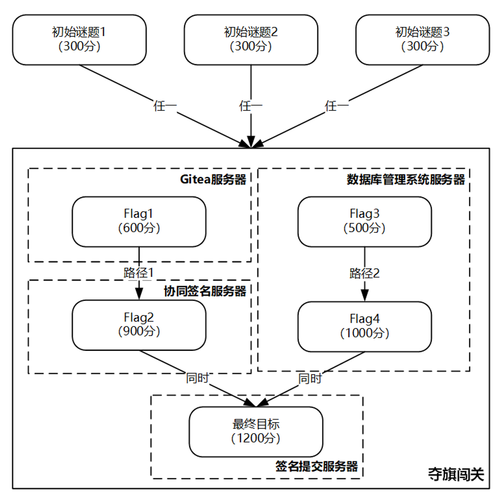

# 2024年第二届熵密杯密码安全挑战赛



- 题目背景

你是一位公司内部工作人员，你们公司最近上线了一个协同签名系统，所有重要事项由总经理通过该系统进行签名确认。有一天，你无意中接触到后台系统管理员的房间，里面有一台未上锁的电脑，其中似乎有着可以接触到公司关键操作的线索。

- 最终目标

你需要利用你的技能和智慧，利用所有可能的线索，搜寻系统中密码应用潜在的漏洞，最终实现完成一次“非法”的签名！

> 注意：你并不是恶意黑客，你的目的是测试系统的安全性，找出可能存在的密码应用漏洞，以便系统开发人员加强系统防御措施。

- 解题路径

本次竞赛共设置初始谜题和夺旗闯关两个环节，其中初始谜题设置 3 道题，闯关夺旗设置 5 道题，共计 8 道题。



## 初始谜题

### 初始谜题1

```
请下载题目附件，并获取在线场景，双击运行附件中的客户端，输入IP地址和端口号连接服务端。请认真分析题目附件中的代码，根据服务端所给出的密文，解密出所对应的明文消息，并提交至服务端。
```

```python
from sympy import Mod, Integer
from sympy.core.numbers import mod_inverse

# 模数
N_HEX = "FFFFFFFEFFFFFFFFFFFFFFFFFFFFFFFF7203DF6B21C6052B53BBF40939D54123"
MODULUS = Integer(int(N_HEX, 16))
MSG_PREFIX = "CryptoCup message:"


# 加密函数
def encrypt_message(message, key):
    # 添加前缀
    message_with_prefix = MSG_PREFIX + message
    message_bytes = message_with_prefix.encode('utf-8')
    message_len = len(message_bytes)
    num_blocks = (message_len + 15) // 16
    blocks = [message_bytes[i * 16:(i + 1) * 16] for i in range(num_blocks)]

    # 进行0填充
    blocks[-1] = blocks[-1].ljust(16, b'\x00')

    encrypted_blocks = []

    k = key

    # 加密每个分组
    for block in blocks:
        block_int = int.from_bytes(block, byteorder='big')
        encrypted_block_int = Mod(block_int * k, MODULUS)
        encrypted_blocks.append(encrypted_block_int)
        k += 1  # 密钥自增1

    # 将加密后的分组连接成最终的密文
    encrypted_message = b''.join(
        int(block_int).to_bytes(32, byteorder='big') for block_int in encrypted_blocks
    )

    return encrypted_message


# 解密函数
def decrypt_message(encrypted_message, key):
    num_blocks = len(encrypted_message) // 32
    blocks = [encrypted_message[i * 32:(i + 1) * 32] for i in range(num_blocks)]

    decrypted_blocks = []

    k = key

    # 解密每个分组
    for block in blocks:
        block_int = int.from_bytes(block, byteorder='big')
        key_inv = mod_inverse(k, MODULUS)
        decrypted_block_int = Mod(block_int * key_inv, MODULUS)
        decrypted_blocks.append(decrypted_block_int)
        k += 1  # 密钥自增1

    # 将解密后的分组连接成最终的明文
    decrypted_message = b''.join(
        int(block_int).to_bytes(16, byteorder='big') for block_int in decrypted_blocks
    )

    # 去除前缀
    if decrypted_message.startswith(MSG_PREFIX.encode('utf-8')):
        decrypted_message = decrypted_message[len(MSG_PREFIX):]

    return decrypted_message.rstrip(b'\x00').decode('utf-8')


# 测试
initial_key = Integer(0x123456789ABCDEF0123456789ABCDEF0123456789ABCDEF0123456789ABCDEF0)
message = "Hello, this is a test message."
print("Original Message:", message)

# 加密
encrypted_message = encrypt_message(message, initial_key)
print("Encrypted Message (hex):", encrypted_message.hex())

# 解密
decrypted_message = decrypt_message(encrypted_message, initial_key)
print("Decrypted Message:", decrypted_message)
```

已知密文为`a7ea042608ffce5be79a19ee45533506819e85f8d9250fccef5a89731151fd7a76d83aa85c47ba1357a86d0e9763470fb608cd54d0927125f500353e156a01da759fa814e96fa41a888eea3a9cf9b062923ed70774add490c7ed7f83d6b47e711e7b3c8a960dcc2838e577459bb6f2769d0917e1fd57db0829633b77652c2180`

方法一：通过动态调试计算获取 key

```python
...
# 动态调试获取第一块明文和密文
m = 89652660640613347754090896429354803559
c = 75949716558974720160457011444725356343804438342271795660520482736366924463482

# 计算密钥
key = Mod(c * mod_inverse(m, MODULUS), MODULUS)
print("Key:", hex(int(key)))
# Key: 0xfb85e511115f381827f03b1cef8e6d52a5c920f8e9e285cc842b3e6ddf935b78

# 解密
encrypted_message = bytes.fromhex("a7ea042608ffce5be79a19ee45533506819e85f8d9250fccef5a89731151fd7a76d83aa85c47ba1357a86d0e9763470fb608cd54d0927125f500353e156a01da759fa814e96fa41a888eea3a9cf9b062923ed70774add490c7ed7f83d6b47e711e7b3c8a960dcc2838e577459bb6f2769d0917e1fd57db0829633b77652c2180")
decrypted_message = decrypt_message(encrypted_message,key=Integer(0xfb85e511115f381827f03b1cef8e6d52a5c920f8e9e285cc842b3e6ddf935b78))
print("Decrypted Message:", decrypted_message)
# Decrypted Message: dHyNBCgxEq4prNBbxjDOiOgmvviuAgfx
```

方法二：静态分析

```python
# 将十六进制密文转换为字节
cipher_bytes = bytes.fromhex("a7ea042608ffce5be79a19ee45533506819e85f8d9250fccef5a89731151fd7a76d83aa85c47ba1357a86d0e9763470fb608cd54d0927125f500353e156a01da759fa814e96fa41a888eea3a9cf9b062923ed70774add490c7ed7f83d6b47e711e7b3c8a960dcc2838e577459bb6f2769d0917e1fd57db0829633b77652c2180")
    
# 提取第一个密文块（32字节）
first_cipher_block = cipher_bytes[:32]
c0 = int.from_bytes(first_cipher_block, byteorder='big')
    
# 构造明文第一个块（前缀的前16字节）
message_with_prefix = MSG_PREFIX.encode('utf-8')
first_plain_block = message_with_prefix[:16]  # 取前16字节
m0 = int.from_bytes(first_plain_block, byteorder='big')
    
# 计算m0在模MODULUS下的逆元
m0_inv = mod_inverse(m0, MODULUS)
    
# 计算初始密钥: k = c0 * m0_inv mod MODULUS
k = (c0 * m0_inv) % MODULUS
```

### 初始谜题2

```
请下载题目附件，并获取在线场景，双击运行附件中的客户端，输入IP地址和端口号连接服务端。请认真分析题目附件中的代码，根据服务端所给出的counter和token，伪造出一个可以通过验证的counter和token，并提交至服务端。
```

题目源代码：

```python
import binascii
from gmssl import sm3


# 读取HMAC key文件
def read_hmac_key(file_path):
    with open(file_path, 'rb') as f:
        hmac_key = f.read().strip()
    return hmac_key


# 生成token
def generate_token(hmac_key, counter):
    # 如果HMAC_KEY长度不足32字节，则在末尾补0，超过64字节则截断
    if len(hmac_key) < 32:
        hmac_key = hmac_key.ljust(32, b'\x00')
    elif len(hmac_key) > 32:
        hmac_key = hmac_key[:32]

    # 将计数器转换为字节表示
    counter_bytes = counter.to_bytes((counter.bit_length() + 7) // 8, 'big')
    # print("counter_bytes:", binascii.hexlify(counter_bytes))

    tobe_hashed = bytearray(hmac_key + counter_bytes)

    # print("tobe_hashed:", binascii.hexlify(tobe_hashed))

    # 使用SM3算法计算哈希值
    sm3_hash = sm3.sm3_hash(tobe_hashed)

    # 将SM3的哈希值转换为十六进制字符串作为token
    token = sm3_hash

    return token


current_counter = 0


def verify_token(hmac_key, counter, token):
    # 生成token
    generated_token = generate_token(hmac_key, counter)
    global current_counter
    # 比较生成的token和输入的token是否相同
    if generated_token == token:
        if counter & 0xFFFFFFFF > current_counter:
            current_counter = counter & 0xFFFFFFFF
            print("current_counter: ", hex(current_counter))
            return "Success"
        else:
            return "Error: counter must be increasing"
    else:
        return "Error: token not match"


# 假设HMAC key文件路径
hmac_key_file = 'hmac_key.txt'
# 假设计数器值
counter = 0x12345678

# 读取HMAC key
hmac_key = read_hmac_key(hmac_key_file)

# 生成token
token = generate_token(hmac_key, counter)
print("Generated token:", token)
print(verify_token(hmac_key, counter, token))
```

知识点：`SM3长度扩展攻击`

### 初始谜题3

```
请下载题目附件，并获取在线场景，双击运行附件中的客户端，输入IP地址和端口号连接服务端。请认真分析题目附件中的代码，根据服务端所给出的公钥和密文，解密出所对应的明文消息，并提交至服务端。
```

题目源代码：

```python
```

知识点：`LWE`

## 夺旗闯关

```

```

## 参考资料

- [CTF-Archives/2024-shangmicup](https://github.com/CTF-Archives/2024-shangmicup)
- [WriteUp | 第二届“熵密杯”密码安全挑战赛解题思路分享](https://mp.weixin.qq.com/s/0WkM0SLgXAv4-FbB9tkKJQ)
- [糖醋小鸡块的blog - 2024-熵密杯-wp-crypto](https://tangcuxiaojikuai.xyz/post/6452f9a0.html)
